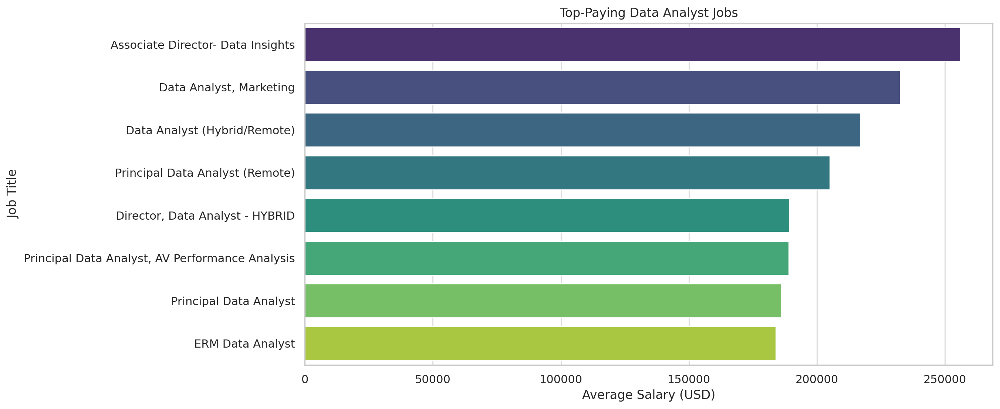
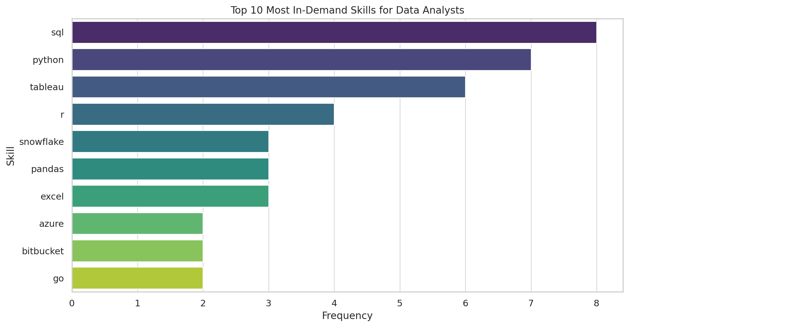

# Introduction
Dive into the data job market! Focusing on data analyst roles, this project explores top-paying jobs, in-demand skills, and where high demand meets high salary in data analytics.

SQL quries? Check them out here: [project_sql folder](/project_sql/)
# Background
Driven by a quest to navigate the data analyst job market more effectively, this project was born from a desire to pinpoint top-paid and in-demand skills, streamlining others work to find optimal jobs.

Data hails from my [SQL Course](https://lukebarousse.com/sql). It's packed with insights on job titles, salaries, locations, and essential skills.

### The questions I wanted to answer through my SQL queries were:

1. What are the top-paying data analyst jobs?
2. What skills are required for these top-paying jobs?
3. What skills are most in demand for data analysts?
4. Which skills are associated with higher salaries?
5. What are the most optimal skills to learn?

# Tools I Used
For my deep dive into the data analyst job market, I harnessed the power of several key tools to ensure a thorough and accurate analysis:

**SQL:** The backbone of my analysis, allowing me to query the database and unearth critical insights.

**PostgreSQL:** The chosen database management system, ideal for handling the job posting data.

**Visual Studio Code:** My go-to for database management and executing SQL queries efficiently.

**Git & GitHub:** Essential for version control and sharing my SQL scripts and analysis, ensuring collaboration and project tracking.

These tools enabled me to delve deeply into the data and extract meaningful insights, providing a reliable foundation for anyone looking to advance their career as a data analyst.

# The Analysis
Each query for this project aimed at investigating specific aspects of the data analyst job market. Here's how I approached each question:

### 1. Top Paying Data Analyst Jobs

To identify the highest-paying roles, I filtered data analyst positions by average yearly salary and location, focusing on remote jobs. This query highlights the high paying opportunities in the field.

```SQL
SELECT
    job_id,
    job_title,
    job_location,
    job_schedule_type,
    salary_year_avg,
    job_posted_date,
    name AS company_name
FROM
    job_postings_fact
LEFT JOIN company_dim ON job_postings_fact.company_id = company_dim.company_id
WHERE 
    job_title_short = 'Data Analyst' AND
    job_location = 'Anywhere' AND
    salary_year_avg IS NOT NULL
ORDER BY
    salary_year_avg DESC
LIMIT 10;
```

Here's the breakdown of the top data analyst jobs in 2023:

- **Wide Salary Range:** Top 10 paying data analyst roles span from $184,000 to $650,000, indicating significant salary potential in the field.

- **Diverse Employers:** Companies like SmartAsset, Meta, and AT&T are among those offering high salaries, showing a broad interest across different industries.

- **Job Title Variety:** There's a high diversity in job titles, from Data Analyst to Director of Analytics, reflecting varied roles and specializations within data analytics.


*Bar graph visualizing the salary for the top 10 salaries for Data Analysts; ChatGPT generated this graph from my SQL query results*

### 2. Skills for Top Paying Jobs

To understand what skills are required for the top paying jobs, I joined the job postings with the skills data, providing insights into what employers value for hihg-compensation roles.

```SQL
WITH top_paying_jobs AS(
    SELECT
        job_id,
        job_title,
        job_location,
        job_schedule_type,
        salary_year_avg,
        job_posted_date,
        name AS company_name
    FROM
        job_postings_fact
    LEFT JOIN company_dim ON job_postings_fact.company_id = company_dim.company_id
    WHERE 
        job_title_short = 'Data Analyst' AND
        job_location = 'Anywhere' AND
        salary_year_avg IS NOT NULL
    ORDER BY
        salary_year_avg DESC
    LIMIT 10)

SELECT *
FROM top_paying_jobs
INNER JOIN skills_job_dim ON top_paying_jobs.job_id = skills_job_dim.job_id
INNER JOIN skills_dim ON skills_job_dim.skill_id = skills_dim.skill_id
ORDER BY
    salary_year_avg DESC
```

Here is the breakdown of the most demanded skills for the top 10 highest paying data analyst jobs in 2023:

**SQL** is leading with a bold count of 8

**Python** follows closely with a bold count of 7

**Tableau** is also highly sought after, with a bold count of 6.

Other like **R**, **Snowflake**, **Pandas** and **Excel** show varying degrees of demand



*Bar graph visualizing the skills count for the top 10 paying jobs for data analysts; ChatGPT generated this graph from my SQL query results*

### 3. In-Demand Skills for Data Analysts

This query helped identify the skills most frequently requested in job postings, directing focus to areas with high demand.

```SQL
SELECT
    skills,
    COUNT(skills_job_dim.job_id) AS demand_count
FROM job_postings_fact
INNER JOIN skills_job_dim ON job_postings_fact.job_id = skills_job_dim.job_id
INNER JOIN skills_dim ON skills_job_dim.skill_id = skills_dim.skill_id
WHERE
    job_title_short = 'Data Analyst' AND
    job_work_from_home = TRUE
GROUP BY
    skills
ORDER BY
    demand_count DESC
LIMIT 5
```
The demand for top skills reveals:

 **SQL**: Essential for database management

 **Excel**: Still widely used for data organization

 **Python**: Versatile for automation and complex analysis

 **Tableau**: Growing need for data visualization

 **Power BI**: Increasing demand for user-friendly BI solutions

| Skills   | Demand Count |
|----------|--------------|
| SQL      | 7291         |
| Excel    | 4611         |
| Python   | 4330         |
| Tableau  | 3745         |
| Power BI | 2609         |

*Table of the demand for the top 5 skills in data analysts job postings*

### 4. Skills based on Salary

This query calculates the average salary for Data Analyst positions, grouped by skills. It excludes records where the average yearly salary is null. The results provide insights into the salary trends associated with different skills sought after in the field of data analysis.

```SQL
SELECT
    skills,
    ROUND(AVG(salary_year_avg), 0) AS avg_salary
FROM job_postings_fact
INNER JOIN skills_job_dim ON job_postings_fact.job_id = skills_job_dim.job_id
INNER JOIN skills_dim ON skills_job_dim.skill_id = skills_dim.skill_id
WHERE
    job_title_short = 'Data Analyst' AND
    salary_year_avg IS NOT NULL
    --AND job_work_from_home = TRUE
GROUP BY
    skills
ORDER BY
    avg_salary DESC
LIMIT 25
```

Key Insights of the query are as follows:

**Specialized Skills:** SVN and Solidity offer high salaries.

**Emerging Tech:** DataRobot, GoLang, and MXNet skills are in demand.

**Data Management:** Terraform, Puppet, and Ansible skills command attractive salaries.

**Data Science:** Keras, PyTorch, and TensorFlow skills are valuable.

**Development Tools:** GitLab, Kafka, and Airflow skills are essential.

**Collaboration:** Notion, Atlassian, and Bitbucket skills remain sought after.

**Analytics:** dplyr and Hugging Face skills are valued.

**Languages:** Perl and Scala skills offer respectable salaries.

| Skills     | Average Salary |
|------------|----------------|
| SVN        | $400,000       |
| Solidity   | $179,000       |
| Couchbase  | $160,515       |
| DataRobot  | $155,486       |
| GoLang     | $155,000       |
| MXNet      | $149,000       |
| dplyr      | $147,633       |
| VMware     | $147,500       |
| Terraform  | $146,734       |
| Twilio     | $138,500       |

*Table of the average salary for the top 10 paying skills for Data Analysts*

### 5. Most Optimal Skills to Learn

This query retrieves the top 10 skills in demand for Data Analyst positions, considering both average salary and the number of job postings. It filters out skills with fewer than 10 job postings and ensures that the jobs allow remote work.

```SQL
SELECT
    skills_dim.skill_id,
    skills_dim.skills,
    COUNT(skills_job_dim.job_id) AS demand_count,
    ROUND(AVG(job_postings_fact.salary_year_avg), 0) AS avg_salary
FROM job_postings_fact
INNER JOIN skills_job_dim ON job_postings_fact.job_id = skills_job_dim.job_id
INNER JOIN skills_dim ON skills_job_dim.skill_id = skills_dim.skill_id
WHERE
    job_title_short = 'Data Analyst'
    AND salary_year_avg IS NOT NULL
    AND job_work_from_home = TRUE
GROUP BY
    skills_dim.skill_id
HAVING
    COUNT(skills_job_dim.job_id) > 10
ORDER BY
    avg_salary DESC,
    demand_count DESC
LIMIT 10;
```
   
This analysis provides a glimpse into skill demand and salary dynamics, aiding in understanding market trends and potential career paths.

- **Go**: Despite a moderate demand count, its high average salary suggests a lucrative market for Go developers.
- **Snowflake & Azure**: Both show significant demand and offer attractive salaries, indicating strong industry reliance on these platforms.
- **AWS**: With a high demand count, AWS skills remain sought after, although the average salary is slightly lower compared to other cloud platforms.
- **Java & Hadoop**: While Java has a lower demand count, its average salary remains competitive. Hadoop's demand count is notable, reflecting continued relevance in big data environments.
- **Confluence & Jira**: Although fewer job postings require these collaboration tools, their salaries are relatively high, indicating specialized expertise.
- **SSIS**: Despite its lower demand count, SSIS skills command a respectable average salary, suggesting niche expertise in data integration.

| Skill ID | Skill       | Demand Count | Avg. Salary |
|----------|-------------|--------------|-------------|
| 8        | Go          | 27           | $115,320    |
| 234      | Confluence  | 11           | $114,210    |
| 97       | Hadoop      | 22           | $113,193    |
| 80       | Snowflake   | 37           | $112,948    |
| 74       | Azure       | 34           | $111,225    |
| 77       | BigQuery    | 13           | $109,654    |
| 76       | AWS         | 32           | $108,317    |
| 4        | Java        | 17           | $106,906    |
| 194      | SSIS        | 12           | $106,683    |
| 233      | Jira        | 20           | $104,918    |

*Table of the most optimal skills for Data Analyst sorted by Salary*

# What I Learned

A summary of the technical learning from this SQL project is as follows:

1. **Query Optimization**: Through crafting SQL queries to extract specific insights from the dataset, you've honed your skills in query optimization. This involves structuring queries efficiently to retrieve desired information while minimizing resource consumption and runtime.

2. **Data Joining**: By utilizing INNER JOINs to combine data from multiple tables based on matching criteria, you've mastered the technique of data joining. This allows for comprehensive analysis by integrating diverse datasets and extracting meaningful relationships between them.

3. **Aggregate Functions**: Through the use of aggregate functions like COUNT() and AVG(), you've learned how to summarize and analyze data at a higher level. These functions enable you to derive valuable insights such as demand counts, average salaries, and skill frequencies from large datasets.

4. **Grouping and Filtering**: You've employed GROUP BY and HAVING clauses to group data based on common attributes and filter results based on specified conditions. This capability enables you to segment data effectively and focus analysis on relevant subsets.

5. **Sorting and Limiting**: With the ORDER BY and LIMIT clauses, you've gained proficiency in sorting query results based on specified criteria and restricting the number of rows returned. This enhances result readability and facilitates focused analysis on top-ranking data points.

6. **Visualization Interpretation**: By generating visualizations from SQL query results, such as bar graphs illustrating skill counts and average salaries, you've learned to interpret and derive insights from graphical representations of data. This skill is invaluable for communicating findings effectively to stakeholders.

Overall, this SQL project has provided hands-on experience in querying, analyzing, and visualizing data, equipping you with essential technical skills for data analysis and decision-making.

# Conclusions

### Insights
The insights gained from the SQL project:

1. **Top-Paying Jobs**: Identified diverse high-paying data analyst roles with a wide salary range, offering clarity on earning potential within the field.

2. **Skills for High-Paying Jobs**: Determined key skills like SQL, Python, and Tableau crucial for top-paying roles, highlighting their significance in data analysis positions.

3. **In-Demand Skills**: Pinpointed essential competencies such as SQL, Excel, and Python through analysis of frequently requested skills, emphasizing their importance in the job market.

4. **Skills Associated with Salary**: Revealed the correlation between specific skills like SVN and Solidity with higher salaries, showcasing emerging technologies like DataRobot and GoLang promising in terms of earning potential.

5. **Optimal Skills to Learn**: Identified the most beneficial skills considering both demand and salary, guiding decisions on skill development for aspiring data analysts to prioritize areas offering the greatest opportunities for career advancement.

Overall, the project provided actionable insights to navigate career paths, enhance skill sets, and capitalize on emerging trends in the data analyst job market.
### Closing Thoughts

In conclusion, this SQL project has provided a thorough exploration of the data analyst job market, uncovering valuable insights that are instrumental for both current professionals and aspiring data analysts. By analyzing job postings, salaries, and skill demands, I have gained a clear understanding of the factors that drive success in this field.